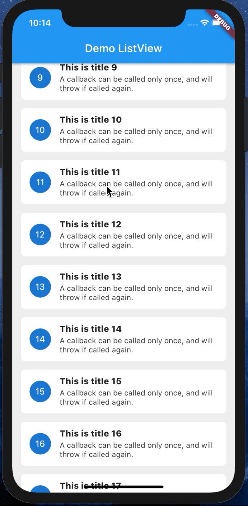

# Paging

A new Flutter package for paging

### Demo

|   |   |   |
|---|---|---|
| | | |


### DataSource
#### PageKeyedDataSource
*Example for load with page index*

1, Define Source

```dart
class ListViewDataSource extends paging.PageKeyedDataSource<int, Note> {
  NoteRepository noteRepository;
  ListViewDataSource(this.noteRepository) {
    isEndList = false;
  }

  @override
  Future<Tuple2<List<Note>, int>> loadInitial() async {
    final result = await noteRepository.getNotes(0);
    return Tuple2(result, 0);
  }

  @override
  Future<Tuple2<List<Note>, int>> loadPageAfter(int params) async {
    if (params == 6) isEndList = true;
    final result = await noteRepository.getNotes(params + 1);
    return Tuple2(result, params + 1);
  }
}
```
2, ListView

```dart
      ListView<Note>(
        key: key,
        padding: EdgeInsets.all(16),
        itemBuilder: (context, data, child) {
          return NoteWidget(data);
        },
        pageDataSource: dataSource,
      ),
```

3, GridView
```dart
      paging.GridView<Note>(
        key: key,
        padding: EdgeInsets.all(16),
        itemBuilder: (context, data, child) {
          return NoteGridWidget(data);
        },
        delegate: SliverGridDelegateWithFixedCrossAxisCount(
            crossAxisCount: 2,
          mainAxisSpacing: 16,
          crossAxisSpacing: 16
        ),
        pageDataSource: dataSource,
      ),
```
#### ItemKeyedDataSource
Coming Soon :))
#### OffsetDataSource
Coming Soon :))
#### IndexDataSource
Coming Soon :))

# Documentation
### BaseWidget Class
| Dart attribute        |Description   |   Default Value |
|:----------------------|:--------------|:----------------|
|emptyBuilder          | builder for empty widget| |
|loadingBuilder          | builder for loading wisdget| |
|errorBuilder          | builder for error widget| |
|itemBuilder          | builder for item widget| |
|pageDataSource          | DataSource for this widget| |

